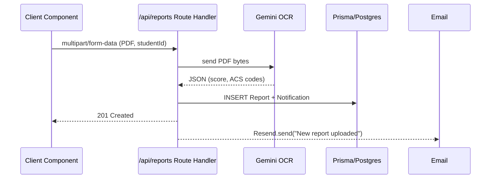

# Architecture for CFIPros MVP (Next.js SaaS)

Status: **Draft**

---

## Technical Summary
CFIPros is a multi‑tenant, AI‑assisted web application that helps flight instructors and schools analyze FAA Airman Knowledge Test reports.  
The MVP is **front‑end first**: a fully mocked Next.js 14 App‑Router UI deployed on Vercel, with Stripe billing, Resend email, and mock JSON data.  
A thin backend (Next.js Route Handlers + Prisma/Postgres + Gemini OCR) will be layered in later epics without restructuring the UI.
*(Note: Backend implementation including Prisma/Postgres is planned to start in Epic 4, per Story 0.7).*

---

## Technology Table

| Technology            | Description / Rationale                                                                                     |
|-----------------------|--------------------------------------------------------------------------------------------------------------|
| **Next.js 14**        | Full‑stack React framework (App Router, Server/Client components)                                            |
| **TypeScript**        | Static typing across front‑end and back‑end code                                                             |
| **Tailwind CSS**      | Utility‑first styling framework                                                                              |
| **shadcn/UI + Radix** | Accessible React primitives & components copied into repo for full theme control                             |
| **Lucide‑react**      | Icon set matching shadcn defaults                                                                            |
| **Vercel**            | Edge‑optimized hosting & CI/CD                                                                               |
| **Jest + React Testing Library** | Unit & component tests (≥ 85 % coverage gate)                                                     |
| **Playwright**        | E2E smoke tests for critical flows                                                                           |
| **GitHub Actions**    | Lint / type‑check / build / Lighthouse CI pipeline                                                           |
| **Vercel Postgres**   | Managed Postgres for production (deferred until backend epics)                                              |
| **Prisma ORM**        | Type‑safe DB access & migrations                                                                             |
| **NextAuth (Auth.js)**| Passwordless & magic‑link authentication, role injection in JWT                                             |
| **Stripe Billing**    | Free / Pro subscription checkout & webhooks                                                                  |
| **Resend + React Email** | Transactional email & templating                                                                          |
| **Gemini OCR / Google Vision** | Extracts scores & ACS codes from uploaded PDFs (called from server route)                         |

---

## Architectural Diagrams

### High‑Level Component Map
```mermaid
graph TD
  subgraph Frontend (Next.js)
    A[App Router<br/>Server Components] -->|fetch| B[Mock Data Layer / API]
    B --> C[Client Components<br/>(Charts, Forms)]
  end

  subgraph Backend (later)
    D[Route Handlers] --> E[Prisma ORM]
    E --> F[(PostgreSQL)]
    D --> G[Stripe SDK]
    D --> H[Resend SDK]
    D --> I[Gemini OCR]
  end

  C -->|Upload PDF| I
  D -->|Webhook| G
```

### Report Upload Flow


---

## Data Models & Schemas

### Report (Prisma & JSON)
```json
{
  "id": "uuid",
  "studentId": "uuid",
  "instructorId": "uuid",
  "organizationId": "uuid",
  "examName": "string",
  "score": 85,
  "date": "2025-04-10",
  "deficiencies": [
    { "code": "UA.I.B.K6", "description": "Weather Theory" }
  ],
  "fileUrl": "https://uploads.cfiPros.com/org_1/report_456.pdf",
  "createdAt": "2025-04-12T08:30:00Z"
}
```

### User Roles
```typescript
export type Role = 'admin' | 'instructor' | 'student';
```

### Notification Payload
```json
{
  "id": "uuid",
  "userId": "uuid",
  "type": "report_uploaded",
  "message": "Charlie Student uploaded a new report.",
  "data": { "reportId": "uuid" },
  "read": false,
  "createdAt": "timestamp"
}
```

---

## Project Structure (Front‑End First)

```
/app
├─ layout.tsx          # global providers
├─ page.tsx            # marketing / redirect
├─ dashboard/          # protected area
│  ├─ layout.tsx
│  └─ page.tsx
├─ students/[id]/      # dynamic routes
├─ api/                # Route Handlers (later)
components/
├─ ui/                 # shadcn components
├─ layout/             # Navbar, Sidebar
mocks/                 # *.json stubs
lib/
├─ mock.ts             # mock‑data utilities
├─ auth.ts             # NextAuth config (later)
├─ email.ts            # Resend (later)
public/
styles/
.github/workflows/ci.yml
```

---

## Infrastructure

| Layer        | Details                                                                                         |
|--------------|--------------------------------------------------------------------------------------------------|
| **Hosting**  | Vercel → Preview & Production environments                                                       |
| **DB**       | Vercel Postgres (PostgreSQL 15, `cfi_pros` database)                                             |
| **Object Storage** | Vercel Blob or AWS S3 for PDF uploads (`/org_{id}/reports/…`)                              |
| **Secrets**  | Managed in Vercel Environment Variables dashboard                                               |
| **CDN**      | Vercel Edge Network automatically caches static assets                                           |

---

## Deployment Plan
1. **Branching:** `main` → production; `develop` → previews.  
2. **CI Gate:** lint, type‑check, unit & e2e tests, `next build`, Lighthouse ≥ 90.  
3. **Vercel Preview Deploys:** every PR for stakeholder QA.  
4. **Production Promotion:** squash‑merge to `main` triggers auto‑deploy.  
5. **Backend Epics:** database migrations via `prisma migrate deploy`; Stripe webhook path set in Vercel.

---

## Change Log
| Date | Change | Author |
|------|--------|--------|
| 2025‑04‑22 | Initial draft extracted from Architecture Blueprint | ChatGPT |
```